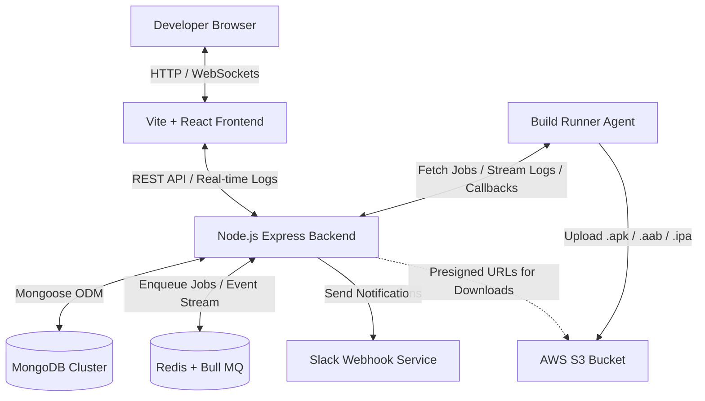

# BuildPortal 🚀
> **A Premium, Self-Hosted Mobile CI/CD Build Server**

BuildPortal is a high-performance, responsive mobile build automation platform. It allows developers to trigger, queue, and compile Android (`.apk` and `.aab`) and iOS (`.ipa` and TestFlight) applications from GitHub and GitLab repositories, stream build logs line-by-line in real-time, store build artifacts in AWS S3, and receive instant Slack notifications when builds are completed.

---

## 📐 System Architecture

Below is the multi-tier topology showing how the **Frontend**, **Backend API Server**, **Redis Build Queue**, **MongoDB Database**, **S3 Artifact Storage**, and the **Remote Build Runner Agent** communicate:



---

## ✨ Core Features

1. **Flexible Platform Orchestration**:
   - **Android**: Supports both debug/release `.apk` bundles and production-ready `.aab` (Android App Bundle) formats.
   - **iOS**: Supports Ad-Hoc/Enterprise `.ipa` distributions and automated uploads to Apple TestFlight.
   - **Dual-platform (`both`)**: Trigger concurrent Android and iOS compiles with a single click.

2. **Real-time Live Logs Console**:
   - Live stream log terminal overlay utilizing WebSockets (`Socket.io`) so developers can view compiler feedback line-by-line.
   - Clean, high-contrast, embedded error diagnostics panel displaying specific build failures.

3. **Enterprise Authentication**:
   - Secure sign-in flows with **GitHub** and **GitLab OAuth 2.0**.
   - Auto-provisioning of user records and profile avatars during the callback exchange.

4. **Android Keystore Manager**:
   - Built-in credentials vault for uploading, archiving, and configuring Android `.jks` keystores per project.

5. **Slack Notification Sync**:
   - Auto-publishes build status summaries (Build Number, Project Name, Platform, Commit ID, Triggered By, and Direct Artifact Links) to Slack channels.

---

## 🛠️ Technology Stack

| Layer | Technologies | Key Modules / Libraries |
| :--- | :--- | :--- |
| **Frontend** | React (v18), Vite, Tailwind CSS v4 | Redux Toolkit, React Router, Socket.io-client, Lucide Icons, Satoshi & Cabinet Grotesk Fonts |
| **Backend** | Node.js, Express, Socket.io | Mongoose (MongoDB ODM), Bull MQ (Redis-backed Queue), AWS SDK v3, Helmet, Rate Limiter |
| **Agent** | Node.js | ChildProcess (CLI Shell execs), FormData Multi-part Uploader, Axios |

---

## 📂 Project Directory Structure

```bash
buildportal/
├── backend/                  # Node.js + Express API Server
│   ├── src/
│   │   ├── config/           # Database configurations
│   │   ├── controllers/      # Route controllers (Auth, Builds, Repos, Keystore)
│   │   ├── middleware/       # Auth checking & global error handler
│   │   ├── models/           # Mongoose schemas (User, Build, Keystore)
│   │   ├── routes/           # API Endpoints
│   │   ├── services/         # Bull MQ, Socket.io, S3, & Slack integrations
│   │   └── server.js         # API Server Entry Point
│   ├── clearDb.js            # Utility to wipe all database collections
│   └── package.json
│
├── frontend/                 # Vite + React Single-Page Application (SPA)
│   ├── src/
│   │   ├── assets/           # Vector SVGs and brand assets
│   │   ├── components/       # Layouts (Sidebar, Header, Main Panel)
│   │   ├── pages/            # View Pages (Build, History, Keystores, Login)
│   │   ├── services/         # Socket.io connection helper
│   │   ├── store/            # Redux Toolkit global store and slices
│   │   ├── styles/           # Main global style variables
│   │   └── main.jsx          # SPA entry point
│   ├── package.json
│   └── vite.config.js
│
└── agent/                    # Lightweight Node-based Runner Agent
    ├── server.js             # HTTP server that runs build shell scripts
    ├── .env.example
    └── package.json
```

---

## 🔑 Environment Variables Setup

### 1. Backend (`backend/.env`)
Create a `.env` file in the `backend/` directory:
```env
PORT=4000
MONGODB_URI=mongodb://localhost:27017/buildportal
JWT_SECRET=your_jwt_signature_secret

# Redis Configuration (For Bull MQ)
REDIS_HOST=127.0.0.1
REDIS_PORT=6379

# GitHub OAuth
GITHUB_CLIENT_ID=your_github_client_id
GITHUB_CLIENT_SECRET=your_github_client_secret
GITHUB_REDIRECT_URI=http://localhost:4000/api/auth/github/callback

# GitLab OAuth
GITLAB_CLIENT_ID=your_gitlab_client_id
GITLAB_CLIENT_SECRET=your_gitlab_client_secret
GITLAB_REDIRECT_URI=http://localhost:4000/api/auth/gitlab/callback

# S3 Storage Configuration
AWS_ACCESS_KEY_ID=your_aws_access_key
AWS_SECRET_ACCESS_KEY=your_aws_secret_key
AWS_REGION=us-east-1
S3_BUCKET_NAME=your_s3_bucket_name

# Slack Webhook (Optional)
SLACK_WEBHOOK_URL=your_slack_webhook_url

# Security configuration
FRONTEND_URL=http://localhost:5173
AGENT_SECRET=your_super_secret_agent_handshake_key
```

### 2. Agent (`agent/.env`)
Create a `.env` file in the `agent/` directory:
```env
PORT=5001
BACKEND_URL=http://localhost:4000
AGENT_SECRET=your_super_secret_agent_handshake_key
WORKSPACE=C:/buildportal/agent_workspace
```

---

## 🚀 Setup & Installation

Ensure you have **MongoDB**, **Redis**, and **Node.js** (v18+) installed on your machine.

### Step 1: Start Redis & MongoDB
Make sure Redis and MongoDB services are actively running in the background.

### Step 2: Set up the Backend
```bash
cd backend
npm install
# Run in development mode (with nodemon)
npm run dev
```

### Step 3: Set up the Frontend
```bash
cd ../frontend
npm install
# Start Vite development server
npm run dev
```
Open your browser at `http://localhost:5173`.

### Step 4: Set up the Build Agent
```bash
cd ../agent
npm install
# Start the runner server
node server.js
```

---

## 🗄️ Database Schemas

### 1. User Schema (`User.js`)
Stores user profiles synchronized dynamically from GitHub and GitLab OAuth logins.
```javascript
{
  name: { type: String, required: true },
  username: String,
  email: String,
  avatar: String,
  provider: { type: String, enum: ['github', 'gitlab'], required: true },
  providerId: { type: String, required: true },
  accessToken: String,
  refreshToken: String,
  gitlabUrl: { type: String, default: 'https://gitlab.com' }
}
```

### 2. Build Schema (`Build.js`)
Tracks the history, credentials, state, and outputs of build jobs.
```javascript
{
  userId: { type: ObjectId, ref: 'User', required: true },
  projectId: { type: String, required: true },
  projectName: { type: String, required: true },
  repoUrl: { type: String, required: true },
  provider: { type: String, enum: ['github', 'gitlab'], required: true },
  branch: { type: String, required: true },
  platform: { type: String, enum: ['android', 'ios', 'both'], required: true },
  androidFormat: { type: String, enum: ['apk', 'aab'], default: 'apk' },
  buildNumber: Number,
  status: { type: String, enum: ['queued', 'building', 'success', 'failed', 'cancelled'], default: 'queued' },
  logs: [{ timestamp: Date, level: String, message: String }],
  artifacts: {
    android: { apkUrl: String, s3Key: String, presignedUrl: String, size: Number },
    ios: { ipaUrl: String, s3Key: String, presignedUrl: String, testFlightLink: String, size: Number }
  },
  startedAt: Date,
  finishedAt: Date,
  duration: Number,
  error: String
}
```

---

## 🧼 Database Maintenance Utility

If you need to completely reset the system's database state for testing or system refreshes, a cleanup utility is available inside the `backend` folder:

```bash
cd backend
node clearDb.js
```
This utility connects to MongoDB, empties the `Build`, `Keystore`, and `User` collections, and gracefully disconnects.

---

## 🔒 Security Practices

1. **Handshake Token authentication**: A cryptographically random `AGENT_SECRET` verifies authorization for all commands and file transfer uploads routed from the remote build runner.
2. **CORS / Secure Headers**: Leverages CORS protection and Express `helmet` to mitigate standard XSS and injection vulnerabilities.
3. **Session Tokens**: Uses JSON Web Tokens (JWT) signed with a secure server-side secret key to authorize clients using HTTP Bearer protocols.
